# Fix Issue

## Setup

Parse arguments — format is: `/fix-issue <issue> [tier]`
- `issue`: required. GitHub issue number (e.g. `42`) or full URL.
- `tier`: optional override: `1`, `2`, or `3`. If omitted, tier is auto-detected.

Examples:
- `/fix-issue 42` → fetch issue #42, auto-detect tier
- `/fix-issue 42 2` → force Tier 2 regardless of auto-detection
- `/fix-issue https://github.com/org/repo/issues/42` → full URL form

Read the agent team guide before doing anything else:
```
~/.codex/plugins/issue-orchestrator/guides/agent-team-guide.md
```

### Repo detection

If `issue` is a full URL, extract `owner/repo` from the URL — no detection needed.

If `issue` is just a number, detect the repo:
```bash
git remote -v
gh repo view --json nameWithOwner
```

From those results, determine the most likely `owner/repo`:
- If the working directory has exactly one GitHub remote, use it.
- If there are multiple remotes (e.g. `origin` + `upstream`), prefer `upstream` if present
  (fork workflow), otherwise prefer `origin`.
- If there is no git remote or the directory is not a git repo, check whether the conversation
  context mentions a repo name or URL.

**Always confirm before fetching the issue.** Present your guess to the user:

```
Repo detected: <owner/repo> (from <source: git remote origin | git remote upstream | gh repo view | conversation context>)

Proceed with issue #<number> in <owner/repo>? [yes / no / different-repo]
```

Wait for the user to confirm or correct before continuing.

If no repo can be guessed at all, ask:
```
Which GitHub repo should I look up issue #<number> in? (e.g. owner/repo)
```

Once confirmed, set `REPO=<owner/repo>` for all subsequent `gh` calls.

---

Fetch the issue:
```bash
gh issue view <number> --repo <owner/repo> --json number,title,body,labels,comments,assignees
```
If `gh` is unavailable, stop and tell the user to install the GitHub CLI.

**Check assignment:** inspect the `assignees` field from the response.
- If the issue is already assigned, note who it is assigned to and proceed.
- If unassigned, attempt to self-assign:
  ```bash
  gh issue edit <number> --repo <owner/repo> --add-assignee @me
  ```
  If the command fails, stop and report the error to the user — do not proceed until the issue is assigned.

### Git root detection (dev container safe)

Before any git operation, resolve the git working tree root. This is required because
in dev containers the shell may start at `/workspaces` which is above the repo mount:

```bash
GIT_ROOT="$(git rev-parse --show-toplevel 2>/dev/null)" || {
  # Try common dev container mount points
  for candidate in /workspaces/*; do
    if [ -d "$candidate/.git" ]; then
      GIT_ROOT="$candidate"
      break
    fi
  done
}
```

If `GIT_ROOT` is still empty, stop and tell the user:
"Could not find a git repository. Make sure you are inside a repo or pass the repo path."

**All `git` commands in this spec must run from `GIT_ROOT`** — either `cd "$GIT_ROOT"` first,
or use `git -C "$GIT_ROOT" <command>`.

Get current repo context:
```bash
git -C "$GIT_ROOT" branch --show-current
git -C "$GIT_ROOT" log --oneline -10
```

Verify the working tree is clean:
```bash
git status --short
```
If there are uncommitted changes, stop and warn the user — do not mix pre-existing changes with issue work.

---

## Step 1 — Assess Complexity

Read the issue title, body, and comments in full. Then assess:

**Signals for Tier 1 (simple):**
- Touches one module or area
- Bug fix, small feature, config or docs change
- Requirements fully described in the issue
- Estimated diff < ~200 lines

**Signals for Tier 2 (medium):**
- Touches 2–4 loosely coupled areas or layers (e.g. frontend + backend, API + tests)
- Requirements clear but spans multiple files/domains
- Estimated diff 200–800 lines
- May still warrant an Architect if the Planner surfaces open questions (see Step 2b)

**Signals for Tier 3 (complex):**
- Spans multiple subsystems or teams
- Issue contains open questions, "TBD", or phrases like "we need to decide"
- Requires changes to shared interfaces, data models, or config
- Estimated diff > 800 lines, or significant unknowns

If a `tier` argument was passed, use that. Otherwise state your assessment and the signals that drove it, then proceed.

Create the feature branch:
```bash
git checkout -b fix/issue-<number>-<slug>
```
where `<slug>` is a 2–4 word kebab-case summary of the issue title.

---

## Step 2 — Planning

Regardless of tier, spawn a **Planner agent** first (`model: "gpt-5.4"`).

### Planner agent instructions

Role: read-only research. No file writes except the plan document.

1. Read the issue (already fetched above — pass it in full).
2. Search the codebase for all affected files:
   - Grep for symbols, function names, patterns mentioned in the issue
   - Read the files most likely involved
3. Produce `ISSUE_<number>_PLAN.md` containing:
   ```markdown
   # Plan: <issue title> (#<number>)

   ## Summary
   [2–3 sentences: what needs to change and why]

   ## Affected Files
   | File | Change type | Owned by |
   |---|---|---|
   | path/to/file | modify / create / delete | Coder A / Integrator |

   ## File Ownership Table
   | Agent | Files |
   |---|---|
   | Coder A | ... |
   | Coder B | ... |
   | Tester | test files |
   | Integrator | shared/wiring files |

   ## Task List
   ### Wave 1 (parallel)
   - Task 1.1: [objective] — Coder A — files: [list]
   - Task 1.2: [objective] — Coder B — files: [list]
   - Task 1.3: [objective] — Tester — files: [list]

   ### Wave 2 (sequential, depends on Wave 1)
   - Task 2.1: [objective] — Integrator

   ## Acceptance Criteria
   - [ ] <binary, verifiable criterion>
   - [ ] <binary, verifiable criterion>

   ## Open Questions
   [List any decisions or ambiguities not resolvable from the issue alone]
   ```
4. For **Tier 1**: the plan may show a single wave with one Coder. That is correct — do not add agents for the sake of it.
5. For **Tier 2 or Tier 3**: list open questions but do not make architecture decisions — those are deferred to the Architect if questions exist.

After the Planner finishes, read `ISSUE_<number>_PLAN.md`.

**Post pre-implementation status to the issue:**
```bash
gh issue comment <number> --repo <owner/repo> --body "$(cat <<'EOF'
## Pre-implementation check

[If Open Questions section is non-empty:]
The following decisions need to be resolved before implementation begins:

<paste Open Questions from the plan>

Proceeding to architecture review (Tier 3) / awaiting decisions before coding starts.

[If Open Questions section is empty:]
No open questions. Plan is complete — proceeding directly to implementation.
EOF
)"
```

**For Tier 2 or Tier 3:** if the plan lists open architecture questions, proceed to Step 2b before spawning any implementation agents. Tier 2 issues with clear requirements and no open questions skip Step 2b entirely.

---

## Step 2b — Architecture (Tier 2 with open questions, or Tier 3)

Spawn an **Architect agent** (`model: "gpt-5.4"`).

### Architect agent instructions

Role: read-only research + produce ADR. No implementation file writes.

1. Read `ISSUE_<number>_PLAN.md` and the full issue.
2. For each open question, research options by reading relevant code, docs, and existing patterns.
3. Produce `ISSUE_<number>_ADR.md`:
   ```markdown
   # ADR: <issue title> (#<number>)

   ## Status: PROPOSED

   ## Context
   [What problem is being solved and what constraints apply]

   ## Decision 1: <topic>
   **Options:**
   - Option A: <description> — pros / cons
   - Option B: <description> — pros / cons
   **Recommendation:** Option X because ...

   ## Consequences
   [Impact on files, APIs, data models, tests, performance]

   ## Updated Acceptance Criteria
   - [ ] ...
   ```

**STOP after the Architect completes.** Post the ADR decisions as checkboxes directly on the GitHub issue so the user can review and select options there:

```bash
gh issue comment <number> --repo <owner/repo> --body "$(cat <<'EOF'
## Architecture Decision Record — Review Required

Please select one option per decision by checking the box, then comment "APPROVED" (or "REJECT" to stop).

---

### Decision 1: <topic>
> <context sentence from ADR>

- [ ] **Option A** — <one-line description> _(recommended)_
- [ ] **Option B** — <one-line description>
- [ ] **Option C** — <one-line description> _(if applicable)_
- [ ] **Other** — describe in a follow-up comment

---

### Decision 2: <topic>  _(repeat block for each decision)_
...

---

_Check one box per decision. Add a comment if you chose "Other" or want to override. Comment **APPROVED** when done, or **REJECT** to stop and reopen._
EOF
)"
```

Then inform the user in chat:

```
Architecture decisions have been posted to issue #<number> as checkboxes.
Please review and select your preferred options directly on the issue, then comment APPROVED or REJECT.
```

**Do not spawn any implementation agents until the user has responded on the issue.**

Poll for the user's response by checking issue comments. When a comment containing "APPROVED" or "REJECT" is found:
- **APPROVED**: read the checkbox states from the ADR comment to determine which options were selected. Update `ISSUE_<number>_ADR.md` status to `ACCEPTED` and revise per any overrides or "Other" comments.
- **REJECT**: stop and report to the user in chat. Do not proceed with implementation.

**Post approved decisions to the issue:**
```bash
gh issue comment <number> --repo <owner/repo> --body "$(cat <<'EOF'
## Architecture decisions approved

The following decisions were reviewed and approved before implementation:

<paste Decision sections from the ADR, including chosen option and rationale>

Implementation is now proceeding.
EOF
)"
```

---

## Step 3 — Implementation

Use the task list from `ISSUE_<number>_PLAN.md` (updated with ADR outcomes if Tier 3).

For each task, spawn the assigned agent with the full task spec. Use `model: "gpt-5.4-mini"` for Coder, Tester, and Integrator agents; use `model: "gpt-5.4"` for Reviewer agents:

```
Issue: #<number> — <title>
Plan: ISSUE_<number>_PLAN.md
ADR: ISSUE_<number>_ADR.md (Tier 3 only, else N/A)

Objective: [from plan task list]

Input:
  - Files to read: [from file ownership table]
  - Prior artifacts: [outputs from dependency tasks, if any]

Output:
  - Deliverable: [files to produce or modify]

Scope (files you may edit):
  - [from file ownership table — this agent's row only]

Out of scope (do not touch):
  - All files not in your Scope list above

Acceptance criteria:
  - [from plan acceptance criteria relevant to this task]

Tools allowed: Read, Edit, Write, Bash, Grep, Glob

Do not:
  - Edit files outside your Scope list
  - Make architecture decisions not covered by the plan/ADR
  - Open PRs or push branches
  - Refactor code unrelated to this task
```

### Tier 1 — single Coder, then Reviewer

Spawn agents sequentially:
```
Coder → [binary checks] → Reviewer
```

### Tier 2 — parallel Coders + Tester, then Integrator

Spawn Wave 1 agents in parallel. Wait for all to finish.
Run binary checks (compile, lint, typecheck, tests).
If checks pass, spawn Integrator. After integration, spawn Reviewer.

### Tier 3 — task queue with waves

For each wave in order:
1. Spawn all agents in the wave in parallel.
2. Wait for all to finish.
3. Run binary checks. If checks fail, stop: re-assign failing files to the same agent with the error as context (max 1 retry). If still failing, stop and report to user.
4. Only advance to the next wave after all checks pass.
After all waves: Integrator, then Reviewers in parallel (correctness / security / performance — one lens per invocation).

---

## Step 4 — Validation

After all implementation agents complete:

**Binary checks (run in order, stop on failure):**
```bash
# adapt commands to the project's actual toolchain
<compile command if applicable>
<typecheck command if applicable>
<lint command if applicable>
<test command>
```

If any check fails: identify the failing file(s), re-assign to the responsible agent with the error output. Max 3 retries per failure. If still failing after 3 retries, stop and report to user — do not commit broken code.

**Maker-checker (if a Coder's output is uncertain):**
- Spawn a separate Checker agent with: the produced code, the task spec, and the acceptance criteria
- Checker returns: pass / fail + specific failure description
- Max 3 rounds. On 3rd failure, escalate to orchestrator.

---

## Step 5 — Reviewer

After all checks pass, spawn the **Reviewer agent** (`model: "gpt-5.4"`).

### Reviewer agent instructions

Role: read-only. Do NOT make any file changes.

1. Read all files changed in this branch:
   ```bash
   git diff main...HEAD --name-only
   git diff main...HEAD
   ```
2. Read the original issue and acceptance criteria from the plan.
3. For each finding, write:
   ```
   ### [SEVERITY: critical|major|minor] <short title>
   **File**: path/to/file:line
   **Problem**: what is wrong and why it matters
   **Fix**: concrete recommendation
   ```
4. Categories to check: correctness, missing tests, security, edge cases, scope creep (changes beyond the issue), breaking changes.
5. Output `ISSUE_<number>_REVIEW.md`.

After the Reviewer finishes:
- **Critical or major findings**: apply targeted fixes, re-run binary checks, then re-run Reviewer (max 2 review iterations).
- **Minor findings only**: apply at discretion; do not re-run Reviewer.
- If after 2 review iterations critical/major findings remain, include them in the PR description as known outstanding items.

---

## Step 6 — Commit and Open PR

Commit all changes:
```bash
git add <only the files changed for this issue — never git add -A>
git commit -m "$(cat <<'EOF'
fix(#<number>): <concise description of what was done>

Closes #<number>

[one-line summary of each logical change if multiple areas touched]

Co-Authored-By: Codex <noreply@openai.com>
EOF
)"
```

Verify PR checklist before pushing:
- [ ] All binary checks pass
- [ ] All acceptance criteria from the plan are met
- [ ] Reviewer findings addressed or documented
- [ ] Only files in-scope for this issue were modified (`git diff main...HEAD --name-only`)

Push and open PR:
```bash
git push -u origin fix/issue-<number>-<slug>
gh pr create --repo <owner/repo> \
  --title "fix(#<number>): <title>" \
  --body "$(cat <<'EOF'
Closes #<number>

## What changed
[bullet summary of implementation approach]

## Tier / approach
Tier <N> — [Planner → Coder → Reviewer | parallel Coders + Integrator | DAG with N waves]

## Acceptance criteria
- [ ] <criterion>
- [ ] <criterion>

## Outstanding items
[any minor review findings deferred, or "None"]

🤖 Generated with Codex
EOF
)"
```

---

## Step 6b — PR Documentation Agent

After the PR is open, spawn a **Documentation Agent** (`model: "gpt-5.4-mini"`) to update the PR body with a detailed human-readable report. This runs before `/review-fix` so reviewers have full context when they open the PR.

### Documentation Agent instructions

Role: read-only research + PR update. Do not modify any source files.

1. Read every file changed in this branch:
   ```bash
   git diff main...HEAD --name-only
   git diff main...HEAD
   ```
2. Read the original issue body and comments in full.
3. Read `ISSUE_<number>_PLAN.md` and (if present) `ISSUE_<number>_ADR.md`.
4. Read the surrounding context for every changed file — not just the diff lines, but the full function or class that was modified, and any callers or dependents one level up.

Produce a PR description that is **up to 2 pages** of flowing technical prose. Update the PR:

```bash
gh pr edit <PR_NUMBER> --body "$(cat <<'EOF'
Closes #<number>

## What changed

<2–4 sentence executive summary: what the issue was, what the fix does, and why this approach was chosen.>

## Implementation walkthrough

### New / modified functions

For each new or significantly changed function or class, write a paragraph:
- **`function_name(params)` in `path/to/file.py`** — what it does, what invariant it
  establishes, what it returns, and any non-obvious design decisions.
- Include its relationship to callers and callees.

### How components interact

If multiple functions or modules were added or changed, describe how they wire together.
Use a Mermaid diagram where the interaction is not obvious from prose alone.
GitHub renders Mermaid natively in markdown.

Example:

```mermaid
graph TD
    A[request] --> B[route_handler]
    B --> C["validate_input() — new: rejects malformed payloads early"]
    C --> D["process_pipeline() — modified: now accepts validated_payload"]
    D --> E[step_a]
    D --> F["step_b() — new: handles the edge case from the issue"]
```


### Default execution path

Describe how the "happy path" changed. Use a before/after format:

**Before**: `A → B → C` — explain what each step was doing and why it was insufficient.

**After**: `A → B → C → D → E` — explain what the new steps add and what invariant is
now satisfied that wasn't before. If the path branched or shortened, describe that too.

### Edge cases and error handling

List any error conditions that are now explicitly handled that weren't before, and what
behaviour the caller can expect in those cases.

### What was intentionally not changed

If the issue touched an area where a change was considered but rejected (e.g. per ADR),
note it briefly so reviewers don't wonder.

## Tier / approach

Tier <N> — <Planner → Coder → Reviewer | parallel Coders + Integrator | DAG with N waves>

## Acceptance criteria

<from ISSUE_<number>_PLAN.md>
- [x] <criterion>
- [x] <criterion>

## Outstanding items

<any minor review findings deferred, or "None">

🤖 Generated with Codex
EOF
)"
```

**Guidelines for the Documentation Agent:**
- Write for a senior engineer who has not read the issue. They should understand the full change from the PR body alone.
- Diagrams must use Mermaid (GitHub renders it natively). Use them when a call graph, data flow, or state transition is being described — not for trivial single-function changes.
- Do not reproduce raw diff. Explain intent and behaviour in prose.
- Do not pad with boilerplate. If a section does not apply (e.g. no new functions), omit it.
- Length target: 1–2 pages. Shorter is fine if the change is genuinely simple; do not inflate.
- The "Default execution path" section is required whenever a pipeline, middleware chain, request handler, or multi-step process was modified.

---

## Final Summary

Present to the user:

```
## fix-issue complete: #<number> <title>

Branch: fix/issue-<number>-<slug>
Tier: <1|2|3> — <rationale>
PR: <url>

### Agents used
- Planner
- [Architect — Tier 3 only]
- Coder A/B/C (list actual tasks)
- Tester
- Integrator (Tier 2/3)
- Reviewer

### Acceptance criteria
- [x] <met criterion>
- [x] <met criterion>
- [ ] <any unmet — with note>

### Review findings
- Critical: <count fixed> fixed, <count deferred> deferred
- Major: <count fixed> fixed, <count deferred> deferred
- Minor: <count fixed> fixed, <count deferred> deferred

### Outstanding items
[anything not resolved, or "None"]
```

---

## Handoff to /review-fix

After presenting the Final Summary, automatically invoke `/review-fix` on the branch that was just created:

```
/review-fix fix/issue-<number>-<slug>
```

Do not wait for the user to invoke it manually. Pass the branch name explicitly so `/review-fix` does not have to re-detect it.

If the PR was not successfully created (push failed, `gh pr create` failed), stop here and do not invoke `/review-fix` — report the failure to the user instead.

---

## Constraints (all agents)

- Follow `~/.codex/plugins/issue-orchestrator/guides/pr-guide.md` for all PR and commit interactions.
- One PR per session. One issue per PR unless issues are tightly coupled.
- Never touch files outside the assigned scope.
- Never make architecture decisions without an approved ADR (Tier 3).
- Never merge. Never force-push. Never commit to main/master.
- Prefer minimal, targeted changes — do not refactor surrounding code unless it is the direct cause of the issue.
- Never skip binary checks before committing.
- If blocked or uncertain, stop and report to the user rather than guessing.
- When handing off to a human (blockers, errors, confirmation prompts), always include the PR URL so the user can navigate to it directly.
